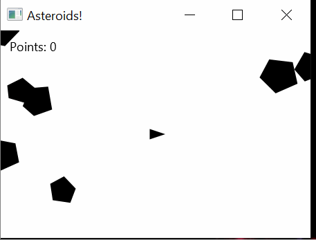

# Asteorids!
A classic Atari video game - Ateroids! 
Project made as one of final assignments of Java Programming II course on University of Helsinki (mooc.fi)

Program uses abstract class 'Character' to give movement to all different obejcts in the game (ship, asteroids and projectiles)

Program uses javafx for GUI

## Example



## Running

It is a simple Java application and it only requires JDK 11 on your machine.

**1. Clone the application**

```bash
git clone https://github.com/Bartosz-Rogala/Asteroids.git
cd asteroids/src
```

**2. Compile**

**Note:**  Download openjfx (I used openjfx-14.0.2.1_windows-x64_bin-sdk) and copy unziped folder to src folder in Asteorids application.

```bash
javac --module-path ./javafx-sdk-14.0.2.1/lib --add-modules javafx.controls AsteroidsApplication.java
```

**2. Run**

```bash
java --module-path ./javafx-sdk-14.0.2.1/lib --add-modules javafx.controls AsteroidsApplication
```
